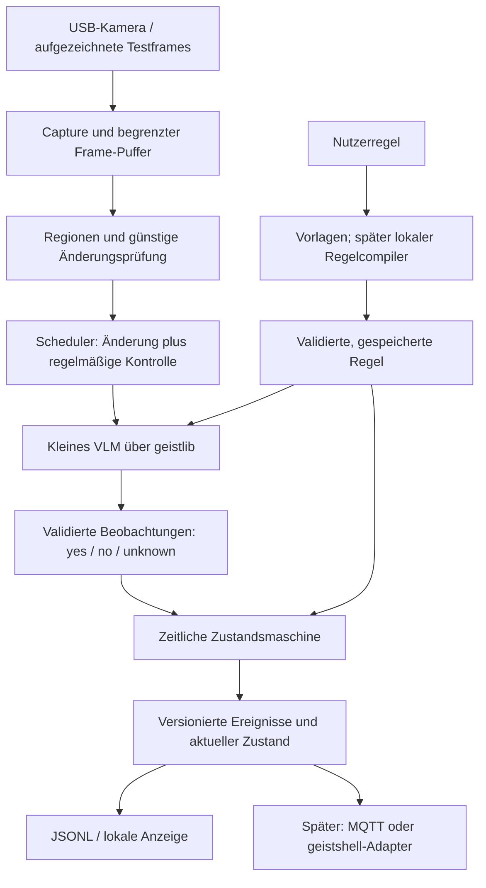

# geist-watch — Implementierungsplan

Stand: 6. September 2026. Status: Entwurf zur Umsetzung; keine Laufzeitsoftware,
Modellportierung oder Hardwaremessung ist bereits umgesetzt.

## 1. Ziel und erste Produktentscheidung

**Tiny local vision agent. Local visual events. No cloud. No video upload.**

Ein Raspberry Pi mit USB-Kamera beobachtet eine festgelegte Szene. Der Nutzer
beschreibt einen gewünschten Hinweis, das System beobachtet sichtbare Zustände
und meldet bestätigte Veränderungen oder ausreichend lange Zustände.

Erste Demo: „Tell me when a package is left at the door.“

Die erste belastbare Bedeutung lautet: Im ausgewählten Eingangsbereich war
kein Paket sichtbar; anschließend ist dort über mehrere Beobachtungen ein
Paket sichtbar. Das beweist weder die Identität eines Zustellers noch den
genauen Ablagevorgang. Eine Meldung heißt deshalb zunächst „Neues Paket vor
der Tür erkannt“. Ein beim Start schon vorhandenes Paket erzeugt einen
Anfangszustand, keine erfundene Zustellung.

Zweite Demo: „Melde dich, wenn die Haustür fünf Minuten offen steht.“

Priorität: überprüfbare Ereignisse, begrenzter Speicherbedarf und ein einfacher
lokaler Installationsweg. Linux/Pi ist das Produktziel; macOS und x86 dienen
auch als Entwicklungs- und Vergleichsplattformen.

## 2. Grundlage aus den vorhandenen Projekten

Untersucht wurden die lokalen Checkouts, insbesondere README, Makefile,
Build-Konfiguration, CI und die öffentliche geistlib-Vision-Schnittstelle.

| Referenz | Übernehmen | Bewusste Auswahl für geist-watch |
| --- | --- | --- |
| geist-memory | C23, kleiner C-Kern, modellfreie Tests, isolierte Build-Verzeichnisse, Sanitizer, Linkage-/Installationsprüfung | Kernbibliothek plus CLI; Make bleibt zentrale Schnittstelle |
| geist-diktat | eigenständiges lokales Produkt, gepinnte geistlib, Modell-Setup, CLI-Komposition, Debian-/Tarball-Pakete, Pi-Tests | Kamera statt Audio; stdout liefert maschinenlesbare Ereignisse |
| geistlib | Inferenz, CPU-Backends, Bildvorverarbeitung und Modellarchitekturen | generische Modellarbeit bleibt in der Engine |
| geistshell | deterministische Aktionskontrolle und vorhandener Machine-Port | später ein lokaler Adapter; Watch erzeugt Beobachtungen und Ereignisse |

Die Geschwister unterscheiden sich beim Dependency-Handling: Diktat synchronisiert
die Engine beim Build, Memory archiviert einen Commit aus einem bereitgestellten
Checkout. Für Watch gilt die Memory-Trennung: explizites `make deps` beschafft
Abhängigkeiten; normale Builds arbeiten danach offline aus einem isolierten,
gepinnten Engine-Snapshot. `make check` benötigt weder Engine noch Modelle.

Referenzstände der untersuchten Checkouts:

- geist-memory: `0efa65317fde8db5b64e1da21c9bb75b4ea7bb28`.
- geist-diktat: `03b589db46cf91443e026c02d438d90596e1819d`.
- geistlib: `f2fcd33211f0a7fe064fbdf55ac44717f1cbfec5`.

Diese Stände dokumentieren die Recherche; der Release-Pin wird erst nach
erfolgreicher Modellintegration ausgewählt. Es gibt genau eine maßgebliche
Engine-Revision in `mk/config.mk`; CI liest dieselbe Konfiguration.

## 3. Umfang der Versionen

| Version | Ergebnis | Grenze |
| --- | --- | --- |
| Machbarkeit | gemessene kleine VLM-Baseline auf Pi, beschriftete Testsequenzen, Engine-Lücken dokumentiert | noch kein Produktversprechen |
| v0.1 | eine Kamera, feste rechteckige Regionen, Paket-Ereignis, Tür-Dauerregel, JSONL, lokale CLI, Linux-Dienst | natürliche Sprache über getestete DE/EN-Vorlagen und explizite Parameter |
| v0.2 | freiere lokale Regelerstellung, MQTT/Home Assistant, geistshell-Adapter | nur freigegebene Ereignis- und Aktionsarten |
| spätere Experimente | mehrere Kameras, visuelle Waschmaschinenanzeige, Topf-Präsenz, Druckfehler | jedes Szenario braucht eigene Daten und Qualitätsfreigabe |

Waschmaschinenstillstand ist kein Beweis für ein fertiges Programm. Dafür wäre
eine sichtbare „Fertig“-Anzeige oder später ein ergänzender Gerätesensor nötig.
Ein sichtbarer Topf sagt nichts Verlässliches über Herdtemperatur oder Gefahr.
Ein fehlgeschlagener 3D-Druck ist eine eigene Erkennungsaufgabe mit speziellen
Perspektiven und Trainings-/Testdaten. Diese Beispiele erweitern v0.1 nicht.

## 4. Modellwahl: zuerst messen, dann portieren

SmolVLM-500M-Instruct ist ein passender erster Kandidat: ein kompaktes
Bild-Sprachmodell aus SigLIP-Bildencoder und SmolLM2-Textdecoder. Die Modellkarte
führt Englisch als Sprache, Apache-2.0 und etwa 0,5 Milliarden Parameter auf.
Die dort genannten 1,23 GB GPU-RAM sind kein gemessener Pi-CPU-RAM-Wert.
[Quelle: Modellkarte](https://huggingface.co/HuggingFaceTB/SmolVLM-500M-Instruct).

SmolVLM2-500M-Video-Instruct ist der zweite Kandidat für Vergleiche mehrerer
Bilder. Seine Modellkarte nennt Video-, Mehrbild- und Bildeingaben; auch hier
ist die GPU-Speicherangabe kein Pi-Benchmark.
[Quelle: Modellkarte](https://huggingface.co/HuggingFaceTB/SmolVLM2-500M-Video-Instruct).

Ein solches VLM enthält bereits einen Sprachdecoder. v0.1 lädt deshalb kein
zweites dauerhaft aktives Sprachmodell. Englische interne Beobachtungsprompts
und feste deutsche/englische Meldungen vermeiden eine ungeprüfte Annahme über
deutsche Modellqualität. Freie deutsche Regelsprache wird separat evaluiert.

Der untersuchte geistlib-Stand dokumentiert Gemma-4-Vision und eine experimentelle
`geist_session_attach_image`-API. SmolVLM/Idefics3 ist dort nicht als unterstützte
Vision-Architektur aufgeführt; auch die gezielte Quelltextsuche lieferte keinen
entsprechenden Treffer. Ein beliebiges SmolVLM-GGUF ist daher kein belegter
Drop-in-Ersatz für das vorhandene Gemma-Vision-Modell.

Vorgehen:

1. Eine gepinnte lokale Referenzimplementierung verwenden: zunächst die offizielle
   Transformers-Implementierung auf dem Entwicklungsrechner, dann eine auf dem Pi
   ausführbare, verifizierte llama.cpp/mtmd-Konfiguration. Python ist nur ein
   Entwicklungswerkzeug. Referenzresultate und Pi-Resultate getrennt ausweisen.
2. 500M-Bildmodell mit wenigen, strikt begrenzten Ausgabetokens prüfen. Danach
   256M als kleinere Vergleichsoption und 500M-Video mit kurzen Bildfolgen testen.
   Quantisierung von Decoder und Vision-Tower jeweils dokumentieren; eine
   Q4-Bezeichnung allein beschreibt nicht den gesamten Speicherbedarf.
3. Gemma 4 über geistlib als vorhandene Integrations-/Qualitätsreferenz nutzen,
   falls die passenden lokalen Gewichte verfügbar sind. Es ist kein Ersatz
   für den Nachweis des kleinen Hardwareprofils.
4. Nur einen erfolgreichen kleinen Kandidaten nach geistlib integrieren.
   Zu prüfen: Gewichtslader und Tensorformen, Vision-Encoder, Projektor,
   Bildnormalisierung, Resize/Patches, Tokenreihenfolge, Sondertokens,
   Chat-Template, Session-Reset und unterstützte Quantisierung.
5. Golden-Tests gegen die Referenz für Vorverarbeitung und Zwischenwerte,
   anschließend Aufgabenqualität auf demselben zurückgehaltenen Testmaterial.
   Numerische Toleranzen je Präzision festlegen; keine identischen freien
   Textantworten verschiedener Backends voraussetzen.

llama.cpp bleibt eine Entwicklungsbaseline. Das Produktziel bleibt der native
geistlib-Pfad. Die konkrete Unterstützung und Artefaktkombination wird am
ausgewählten Commit ausgeführt und belegt.
[Quelle: mtmd-Dokumentation](https://github.com/ggml-org/llama.cpp/blob/master/tools/mtmd/README.md).

**Entscheidungspunkt:** Scheitert ein kleiner Kandidat an Qualität oder Latenz,
wird der Port nicht blind fortgesetzt. Zuerst ROI, Beleuchtung, Bildgröße und
Quantisierung vergleichen. Danach das Profil einschränken, ein größeres Modell
mit entsprechendem Hardwarebedarf ausweisen oder gezieltes Fine-Tuning planen.
Es gibt keinen stillen Cloud-Fallback.

## 5. Architektur



Der zeitliche Kern ist eine reine Funktion aus vorherigem Zustand, validierter
Beobachtung und Zeitstempel. Dadurch lässt sich seine Entscheidung ohne Kamera
und Modell vollständig testen und aus Beobachtungsprotokollen wiederholen.

### Aufnahme und Scheduling

- Linux zuerst: V4L2/UVC, explizite Format-/Auflösungsprüfung; zunächst YUYV.
  MJPEG-Support separat über eine dokumentierte Decoder-Abhängigkeit ergänzen,
  wenn die ausgewählte USB-Kamera es benötigt. Eine unterstützte Kamera als
  Referenz benennen; nicht pauschal alle USB-Kameras versprechen.
- Plattformneutraler Replay-Eingang mit PPM/RGB-Testframes und Zeitmanifest.
  Native macOS-Kameraaufnahme ist ein späterer Adapter.
- Ein voller Frame plus wenige begrenzte ROI-/Arbeitsbuffer. Der neueste Frame
  ersetzt wartende alte Frames; es entsteht keine wachsende Videowarteschlange.
- Günstige Bilddifferenz kann Inferenz anstoßen. Zusätzlich gibt es zwingend
  regelmäßige VLM-Beobachtungen, damit ein ruhender Zustand oder eine offene
  Tür weiterhin geprüft wird. Motion-Gating ist keine Zustandsbestätigung.
- Startkonfiguration: Capture etwa 2 fps, semantische Prüfung etwa alle 5–10 s,
  abhängig vom gemessenen Pi-Profil; nur ein Inferenzauftrag gleichzeitig.
  Timer-/Bestätigungsregeln müssen zur tatsächlich erreichbaren Rate passen.
- Bildzeit, Verarbeitungszeit und Queue-Alter getrennt erfassen. Wiederholte
  Auswertung desselben Frames zählt nie als zusätzliche Evidenz.
- Bei Kameraausfall, veralteten Frames, ungültigem Modelloutput oder verdeckter
  Region lautet der Zustand `unknown`; begrenzte Wiederanläufe und klare
  Gesundheitsmeldungen ersetzen unbegrenzte Retries.

### Beobachtungsvertrag

Für jede Region wenige konkrete Fragen: Paket sichtbar? Tür offen? Region
auswertbar? Ausgabe in einem kleinen Schema mit `yes`, `no`, `unknown`.
Keine freien Caption-Texte als Entscheidungsgrundlage.

Wo das Backend es unterstützt, Ausgabe auf erlaubte Tokens/Grammatik begrenzen.
Zusätzlich immer strikt parsen und Größe, Datentypen und Werte validieren.
Schema-Konformität beweist keine richtige Erkennung. Selbst erzeugte numerische
„Confidence“-Werte werden nicht als kalibrierte Wahrscheinlichkeit behandelt.

Der Modelladapter kapselt die experimentellen geistlib-Aufrufe. Eine frische
oder korrekt zurückgesetzte Session pro Beobachtung verhindert unkontrolliertes
Anwachsen von Bildtokens und Kontext. Geteilte Modellgewichte bleiben geladen.

### Zeitliche Zustandslogik

Paketregel:

- Initialisierung mit `unknown`, dann stabile Anfangslage lernen.
- Zustand `absent` nach mehreren frischen negativen Beobachtungen bestätigen.
- Übergang zu `present` erst nach beispielsweise drei positiven Beobachtungen
  über mindestens zehn Sekunden; Parameter anhand der Validierungsdaten wählen.
- Genau ein logisches `package_appeared`-Ereignis je bestätigtem Übergang.
  Erneutes Scharfstellen erst nach bestätigter Abwesenheit. Ein Cooldown allein
  genügt nicht, weil er dauernd vorhandene Pakete erneut melden würde.
- Nach Verlust der Sicht keine lückenlose Zustandskenntnis behaupten. Bei
  Wiederkehr neu bestätigen; eine unklare Ankunft nicht als sichere Zustellung
  melden. Entfernung/erneute Ablage innerhalb einer Beobachtungslücke kann
  unentdeckt bleiben und wird als Sampling-Grenze dokumentiert.

Türregel:

- Monotone Uhr für die Dauer; UTC nur für Anzeige und Ereignisprotokoll.
- Fünf Minuten erfordern regelmäßig bestätigtes `open`. Ein frisches `closed`
  oder `unknown` unterbricht die Evidenz und setzt den Dauerlauf zurück.
- Auch ohne neue Frames tickt der Kern: Überschreitet das Alter der letzten
  Beobachtung `max_gap`, wird die Evidenz ungültig. Beispielwert 15 s nur für
  ein Hardwareprofil, das diesen Abstand zuverlässig einhalten kann.
- Gemeldet wird eine über Stichproben bestätigte Offen-Dauer. Bewegung zwischen
  den Aufnahmen kann kein bildbasiertes Sampling ausschließen.
- Neustarts übernehmen keine monotone Dauer aus einem früheren Prozesslauf.

### Ereignisse und Speicherung

Versioniertes JSONL mit `schema_version`, `event_id`, `camera_id`, `rule_id`,
`event_type`, `observed_at`, `emitted_at` und der Zahl bestätigender Beobachtungen.
Separat aktueller Zustand mit Alter und `healthy/degraded/offline`.

stdout ist ausschließlich für JSONL reserviert, stderr für Diagnose. Regeln
liegen unter XDG_CONFIG_HOME, Zustände und begrenzte Ereignisprotokolle unter
XDG_STATE_HOME, Modelle unter XDG_DATA_HOME. Standardmäßig werden keine Bilder
oder Videos auf Platte geschrieben. Opt-in-Diagnosebilder erhalten ein festes
Platzlimit und eine Löschfrist; sie werden nie automatisch hochgeladen.

Zustand atomar schreiben, Dateiversionen und Größen prüfen. Für zuverlässige
Adapterzustellung später eine begrenzte persistente Outbox mit stabiler
Ereignis-ID vorsehen. Lokale Ereignisbildung und Transportzustellung sind
verschiedene Garantien: MQTT kann doppelt zustellen, Konsumenten deduplizieren.
Die CLI verspricht über einen Prozessabsturz hinweg keine Exactly-once-Zustellung.
Volle Platte und volle Ausgabepuffer erzeugen sichtbare Fehler statt stillen Verlust.

## 6. Bedienung und natürliche Sprache

Geplante Schnittstelle, noch keine ausführbaren Befehle:

```sh
geist-watch setup --model smolvlm-500m
geist-watch doctor
geist-watch rule add --name doorstep --region 0.15,0.35,0.70,0.60 \
  --when "Tell me when a package is left at the door."
geist-watch rule show doorstep
geist-watch run --camera /dev/video0 --rules rules.json
geist-watch replay --manifest test-scene.json --rules rules.json
geist-watch status --json
```

Regionen sind normierte `x,y,width,height`-Werte; die CLI prüft Bildgrenzen und
zeigt die resultierende Regel mit Bestätigungsdauer und Meldung an. Das
Einrichten der Perspektive und Region gehört zur Demo, nicht zu einem
versteckten manuellen Vorverarbeitungsschritt.

v0.1 unterstützt definierte DE/EN-Satzvorlagen für Paket und Tür sowie eine
explizite JSON-Regel. Unbekannte Formulierungen werden verständlich abgelehnt.
Das ist noch kein allgemeines Verständnis beliebiger Nutzerwünsche.

v0.2 erzeugt ein lokaler Sprachmodellaufruf bei der Einrichtung einen Vorschlag
für dieselbe kleine Regelstruktur. Zunächst den bereits vorhandenen Decoder
auf Eignung testen; nur bei nachgewiesenem Bedarf ein separates kleines SLM
kurzzeitig laden. Ausgabe validieren, verständlich anzeigen und vom Nutzer
aktivieren lassen. Der Compiler erzeugt keine Shell-Befehle. Aktionen stammen
aus vom Nutzer konfigurierten Zielen. Bildinhalt und Modelltext bleiben Daten.

## 7. Geplante Projektstruktur

```text
geist-watch/
├── README.md, PLAN.md, LICENSE, CHANGELOG.md, CONTRIBUTING.md
├── Makefile, .clang-format, .gitignore
├── mk/config.mk
├── include/geist_watch.h
├── src/
│   ├── gw_core.c, gw_rules.c, gw_state.c, gw_event.c
│   ├── gw_store.c, gw_platform.c
│   ├── gw_capture_v4l2.c, gw_capture_replay.c
│   ├── gw_schedule.c, gw_engine.c
│   └── cli.c
├── tests/                  # C-Kerntests, Mock-Engine, CLI-Verträge
│   └── fixtures/           # kleine synthetische Daten und Manifeste
├── examples/rules/         # doorstep.json, door-open.json
├── benchmarks/             # Harness, Datenmanifest, Ergebnisse je Gerät
├── tools/                  # explizites Dependency-/Modell-Setup
├── packaging/              # .deb, Tarball, systemd-Unit, Installer
├── integrations/           # spätere MQTT-/geistshell-Adapter
├── docs/                   # Architektur, Regeln, Validierung, Hardware
└── .github/workflows/      # CI, echte Modelltests, Pi, Release
```

`libgeist_watch.a` enthält den modellfreien Zustandskern mit einer kleinen
API wie `gw_init`, `gw_observe`, `gw_tick`, `gw_get_state`. Buffer-Ownership,
Lebensdauer, Fehlercodes und Limits werden vor Implementierung dokumentiert.
CLI und Kamera-/Engine-Adapter bilden das Produktbinary `geist-watch`.
Die Aufteilung kann anfangs aus weniger Dateien bestehen; leere Subsysteme
werden erst angelegt, wenn ihr Meilenstein beginnt.

## 8. Build, Tests und Auslieferung

C23, GNU Make 3.81+, GCC 14+/Clang 19+ als anfängliche Compilerbasis nach
geist-memory. Warnungen streng behandeln; notwendige Engine-Ausnahmen auf
deren Build begrenzen. Versionierte Formatierkonfiguration übernehmen.

Geplante Make-Ziele:

```text
make help / print-config       alle Einstiege und effektive Konfiguration
make deps / setup              Engine bzw. Modell explizit beschaffen
make / lib                     CLI bzw. Kernbibliothek bauen
make check                     modellfreie C- und CLI-Tests
make MODE=asan check fuzz       ASan/UBSan und Parser-/State-Fuzzing
make format-check / analyze    Formatierung und statische Analyse
make test-e2e                  echte Gewichte und beschriftete Sequenzen
make bench / bench-pi          Phasenlatenz, Ereignisqualität, RAM, Energie
make check-linkage             tatsächliche Laufzeitabhängigkeiten
make check-install             Installation unter DESTDIR und Consumer-Test
make deb / tarball             lokale Release-Artefakte
make check-repro               zwei frische Builds unter gleicher Toolchain
make release-check             alle für die Freigabe erforderlichen Gates
```

`TARGET=linux-x86_64|linux-aarch64|pi5|darwin-arm64`,
`MODE=release|debug|asan`, zunächst CPU-Backends. Generisches ARM64 darf keine
Pi-spezifischen CPU-Flags erben. Separate Build-Pfade pro Target, Modus,
Compiler-/Flag-Konfiguration und Engine-Pin. Keine Submodule nötig.

Runtime ohne Python oder Node. Test-/Konvertierungswerkzeuge dürfen davon
abhängen und sind nicht Teil des installierten Produkts. Linux-musl-Static
als geprüftes Profil; Systembibliotheken auf macOS. Kamera-Decoder und spätere
MQTT-Abhängigkeiten in Linkage- und Paketmanifesten ausweisen.

CI je PR: Linux x86_64/ARM64 und macOS ARM64; GCC/Clang, modellfreie Tests,
Sanitizer, Format, Parser-Fuzzing, Pakete und Installation. Kamera- und
Modelltests ausdrücklich getrennt ausweisen. Fehlende Gewichte dürfen einen
expliziten `test-e2e`-/Release-Aufruf nicht erfolgreich passieren lassen.

Echte Pi-Läufe auf kontrolliertem Hardware-Runner: nur vertrauenswürdige
Revisionen, keine beliebigen Fork-PRs auf einem privaten Gerät ausführen.
Nachts Regressionen und vor Releases 24-h-Dauerlauf mit festgelegter Szene.

Setup pinnt Modellrevision, alle Dateien einschließlich Vision-Tower/Projektor,
SHA-256, Lizenz und Downloadgröße. Download in temporäre Dateien, prüfen, dann
atomar installieren. Laufzeit startet offline ohne Downloadversuch. Ein lokales
Modellverzeichnis ermöglicht die komplett netzfreie Einrichtung.

Release: Debian arm64/amd64 und Linux-Tarballs; macOS zunächst Replay/CLI.
Modellgewichte getrennt vom Programm. systemd-Dienst als unprivilegierter
Benutzer mit notwendigem Kamerazugriff und begrenzten Schreibverzeichnissen.
Installation aktiviert keine Kamera automatisch. SHA256SUMS und Build-Provenance
wie bei Diktat; Reproduzierbarkeit nur innerhalb dokumentierter Toolchain-Bedingungen.

## 9. Messbare Freigabekriterien

Die folgenden Zahlen sind **Zielwerte, keine Messergebnisse**. Nach dem ersten
Machbarkeitslauf ein Hardwareprofil festlegen und Schwellen vor dem abschließenden
Test einfrieren. Verfehlte Ziele werden sichtbar berichtet.

| Bereich | Anfängliches Ziel für v0.1 |
| --- | --- |
| Referenzhardware | Pi 5 mit 4 GB als Entwicklungsbasis, USB-UVC-Kamera, 64-bit Linux; 2 GB danach prüfen |
| Speicher | Gesamtprozess-Peak-RSS ≤ 1,5 GiB für kleines Modell inkl. Tower, KV und Bildbuffer; ohne Swap |
| Inferenz | p95 ≤ 10 s pro semantischer Beobachtung auf dem festgelegten Bild-/ROI-Profil |
| Ereignislatenz | Paket: p95 ≤ 45 s ab erster sichtbarer Ablage im Ground Truth, einschließlich Bestätigung |
| Erkennung | Paket-Ereignisse: Precision ≥ 95 %, Recall ≥ 90 % auf zurückgehaltenen Szenen |
| Fehlalarme | höchstens 1 falsches Paket-Ereignis pro 24 Kamerastunden im Negativ-Dauerlauf |
| Dauerregel | kein Tür-Ereignis vor 300 s gültiger Evidenz; Ausfall/unknown/Neustart erzeugt keine falsche Dauer |
| Stabilität | 24 h ohne Crash, unbeschränkte Queue oder fortschreitendes Speicherwachstum |
| Lokalität | nach Setup mit deaktiviertem Netzwerk vollständig funktionsfähig; keine Bild-/Videoausleitung |

Mindestens 50 positive Ablagesequenzen über mehrere Szenen plus 24 Stunden
negative Aufnahmen für die erste Evaluation. Tage/Kamerapositionen für
Entwicklung und Test trennen, nicht benachbarte Frames derselben Aufnahme.
Eine kleine Sammlung ist ein erster Nachweis, keine allgemeine Zuverlässigkeitsgarantie.

Sequenzen enthalten: vorhandenes Paket beim Start, Ablage, Abholung, erneute
Ablage, Person mit getragenem Paket, Tasche statt Paket, Schatten, Gegenlicht,
Dämmerung, Verdeckung, Kameraverschiebung, Kameraausfall und Neustart.
Türtests ergänzen kurze Öffnung, 299/300-s-Grenzen, zwischenzeitliches Schließen,
fehlende Frames, Uhrsprung und Prozessneustart. Kern-Dauertests nutzen eine
virtuelle Uhr; sie warten nicht fünf echte Minuten.

Ereignisse anhand vorab festgelegter Zeitfenster eindeutig Ground-Truth-Ereignissen
zuordnen. Zusätzliche Meldungen zählen als Fehlalarme; `unknown`-Phasen und verpasste
Ereignisse dürfen nicht aus dem Nenner verschwinden. Precision/Recall und rohe
TP/FP/FN, Verfügbarkeit sowie Unsicherheitsintervalle zusammen veröffentlichen.

Benchmark-Bericht enthält Modell-/Engine-Hash, Quantisierung aller Komponenten,
Compilerflags, OS, Kamera, ROI, Auflösung, Sampling, Prompt, Tokenlimits,
Warm-/Kaltstart, Capture-/Encoder-/Prefill-/Decode-Zeiten, p50/p95, Peak-RSS,
Temperatur/Throttling und gemessene Leistungsaufnahme. Token/s allein reicht nicht.

## 10. Arbeitspakete und Abhängigkeiten

Aufwand als grobe Größenordnung für eine erfahrene Vollzeitentwicklung;
Beschaffung, Datensammlung und offene Engine-Arbeit können die Spanne verlängern.
Die Zeilen sind lokale Ticketvorschläge, keine bereits angelegten GitHub-Issues.

| ID | Arbeitspaket | Abhängigkeit | Abnahme | Richtwert |
| --- | --- | --- | --- | --- |
| W01 | `geisten/geist-watch` anlegen, Lizenz, Make-/CI-Grundlage, Konventionen | Projektplan | leeres Projekt baut; modellfreie Prüfung läuft auf den Zielplattformen | 1–2 Tage |
| W02 | Datenmanifest, Ground Truth, Replay-/Benchmark-Harness | W01 | wiederholbarer Lauf mit getrennten Entwicklungs-/Testszenen | 3–5 Tage |
| W03 | kleine VLMs auf Pi vergleichen; Modellentscheidung | W02 | Qualitäts-/RAM-/Latenzbericht und Go/No-go | 3–5 Tage |
| W04 | gewählten VLM-Pfad in geistlib ergänzen | W03 Go | Referenzparität, reale Pi-Inferenz, neuer Engine-Pin | 1–3 Wochen, größte Unsicherheit |
| W05 | Beobachtungs-/Regelschema und zeitlicher Kern | W01 | Paket-/Türtests inkl. unknown, Timer, Ausfall, Neustart modellfrei grün | 4–6 Tage |
| W06 | V4L2, ROI, Scheduler und Watch-Engineadapter | W04, W05 | echte Kamera liefert begrenzten Beobachtungsstrom ohne Backlog | 4–6 Tage |
| W07 | CLI, DE/EN-Vorlagen, Zustand/JSONL, Diagnose | W05, W06 | beide Demos ohne Entwicklerhandgriffe außer Kalibrierung ausführbar | 3–5 Tage |
| W08 | Setup, systemd, Pakete, Fehlerbehandlung | W07 | Installation/Offline-Neustart auf sauberem Pi; Linkage geprüft | 3–5 Tage |
| W09 | zurückgehaltener E2E-Test, 24-h-Test, Demo und v0.1 | W02–W08 | Kriterien aus Abschnitt 9 erfüllt oder Release ausdrücklich eingeschränkt | 3–5 Tage plus Dauerlauf |
| W10 | MQTT/Home Assistant und geistshell-Adapter | W09 | lokale Automation, Reconnect und Deduplizierung getestet | v0.2 |
| W11 | freier lokaler Regelcompiler | W09 | DE/EN-Korpus, abgelehnte Mehrdeutigkeiten, validierte Aktivierung | v0.2 |

Kritischer Pfad: W01 → W02 → W03 → W04 → W06 → W07 → W08 → W09.
W05 kann unabhängig von der Modellportierung bearbeitet werden. Grob ergibt
sich ein v0.1-Korridor von etwa **7–11 Wochen**, abhängig von Portierung und Daten.
Ein erster Referenz-Demonstrator ist früher möglich, aber noch kein natives
geistlib-Release und kein bestandener 24-h-Qualitätsnachweis.

**Erster konkreter Umsetzungsschritt nach dem Projektgerüst:** Zehn kurze
Paket-/Negativsequenzen durch eine lokale 500M-Referenz laufen lassen und auf
dem Pi Peak-RSS, Beobachtungslatenz und Fehlerfälle messen. Das entscheidet
früh, ob die langfristige Engine-Investition trägt.

## 11. Anschluss an den Geist-Stack

Home Assistant erhält später nur Ereignisse und Zustände über einen lokalen
MQTT-Broker. Discovery, Verfügbarkeit/Last Will und Wiederanmeldung nach HA-
Neustart gehören zum Adapter; Ereignisse nicht als retained Nachricht erneut
auslösen, Zustände mit Frische-/Verfügbarkeitsinformation behandeln.
[Quelle: Home Assistant MQTT](https://www.home-assistant.io/integrations/mqtt/).

Der bestehende geistshell-Machine-Port liest Programme, die einen Integer
ausgeben. Dafür ist ein Adapter sinnvoll, der einen gespeicherten/latchenden
Watch-Zustand liefert, beispielsweise `0=absent`, `1=present`, `2=unknown`.
Für die Erkennung neuer Ereignisse zusätzlich Sequenznummer/Acknowledgement
spezifizieren; eine reine kurzlebige Pipe kann zwischen zwei Polls verloren gehen.
Diese Adapterbefehle müssen erst implementiert werden.

geistshell entscheidet über Aktionen mit seiner vorhandenen Policy. Eine
einfache Home-Assistant-Automation kann auch direkt MQTT konsumieren. Bei beiden
Varianten bleiben Modelle und Bildauswertung auf dem Pi; das lokale Netz
transportiert nur die konfigurierten Zustands-/Ereignisdaten.

geist-memory ist kein Pflichtbestandteil von v0.1. Ein kleiner Zustandsautomat
braucht keine semantische Datenbank. Später kann Memory Ereignisbeschreibungen
für lokale Rückfragen indexieren; Bilder bleiben separat und standardmäßig flüchtig.

## 12. Hardwareversprechen und Demonstration

„Local visual event detection for $50 hardware“ ist zunächst ein Kostenziel.
Raspberry Pi kündigte den Pi 5 mit 1 GB im Dezember 2025 für $45 allein für das
Board an. Das ist kein vollständiges Kamera-Kit und kein Nachweis ausreichenden
RAMs für Watch. Vor Veröffentlichung eine aktuelle Stückliste mit Kamera,
Netzteil, Speicher, Kühlung, Währung, Steuern und Datum erstellen; vorhandene
Hardware separat ausweisen.
[Quelle: Raspberry Pi](https://www.raspberrypi.com/news/1gb-raspberry-pi-5-now-available-at-45-and-memory-driven-price-rises/).

Die erste Veröffentlichung zeigt eine echte lokale Szene: Regel eingeben,
leeren Eingangsbereich lernen lassen, Paket ablegen, bestätigte Meldung erhalten,
Paket liegen lassen ohne weitere Meldungen, abholen und erneut ablegen.
Nebenbei sichtbar: verwendetes Pi-Modell, Modellhash, RAM, Ereignislatenz und
deaktivierter Internetzugang. Aufnahme und Zeitmessung müssen erkennen lassen,
ob das Video gekürzt wurde.

Für Maker/Pi: nachbaubare Stückliste und Installation. Für LocalLLaMA:
Modellvergleich und reproduzierbare Benchmarks. Für Home Assistant:
lokale Ereignisschnittstelle. Für Hacker News: kleiner C-Kern, verständlicher
Zustandsautomat, ehrliche Fehlfälle und ein reproduzierbarer Offline-Nachweis.

Das langfristige Ergebnis ist ein wiederverwendbarer kleiner Vision-Pfad in
geistlib und ein eigenständiges Produkt, dessen Ereignisse sich überprüfen lassen.
